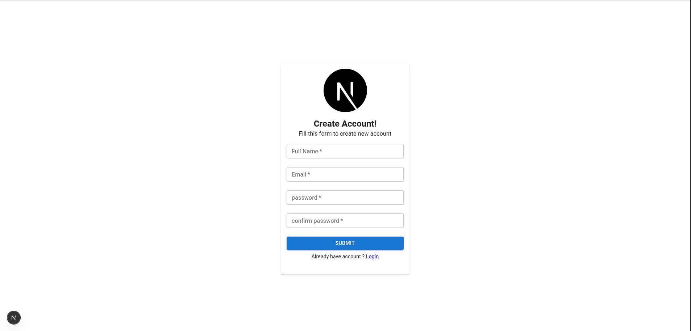

<div align="center">


<h3 align="center">🛍️ Next.js E-Commerce Website (MUI) — Work in Progress</h3>

</div>

---

## 🚧 Project Status

**This project is currently under active development.**  
At the moment, the **User Registration Page** is completed, and more features are being built step by step.

> ✅ Registration Page — Completed  
> 🚧 Login, Products, Cart, Admin — In Progress

---

## 🚀 Project Overview

This is a **modern eCommerce web application** built with **Next.js (App Router)**, focused on clean UI, scalability, and real-world architecture.

The frontend is built using **Material UI (MUI)** combined with **Tailwind CSS** for flexible and efficient styling.  
The backend (in progress) will use **MongoDB**, **JWT authentication**, and modern API patterns.

This project is being developed as a **real production-style application**, not just a UI demo.

---

## ⚙️ Tech Stack

### 📦 Framework & Libraries
- **Next.js 16** – App Router, SSR
- **React 19**
- **Material UI (MUI)** – UI components & theming
- **Tailwind CSS** – Utility-first styling
- **Emotion** – MUI styling engine

### 🧠 State & Data (Planned)
- **TanStack Query (React Query)** – Data fetching & caching
- **Redux Toolkit** – Global state management

### 📂 Backend (Planned)
- **MongoDB**
- **Mongoose**
- **JWT Authentication**
- **bcrypt**

---

## ✨ Features

### ✅ Completed
- 📝 **User Registration Page**
  - Clean, responsive UI
  - Built with MUI + Tailwind
  - Form validation ready
  - Optimized input styles (compact MUI fields)

### 🚧 In Progress / Planned
- 🔐 Login & Authentication
- 🛍️ Product listing & details
- 🛒 Cart & checkout
- 📊 Admin dashboard
- 💳 Payment integration
- ☁️ Image uploads

---

## 📸 Screenshots

## 📸 Screenshots

| Page | Preview |
|------|---------|
| 📝 Registration Page |  |
| 🔐 Login Page | 🚧 In Progress |
| 🏠 Home Page | 🚧 Planned |
| 🛍️ Shop Page | 🚧 Planned |
| 🛒 Cart Page | 🚧 Planned |
| 📊 Admin Dashboard | 🚧 Planned |

> Screenshots will be added as features are completed.


> Screenshots will be added as features are completed.

---

## 📦 Installation & Setup

```bash
npm install
npm run dev
